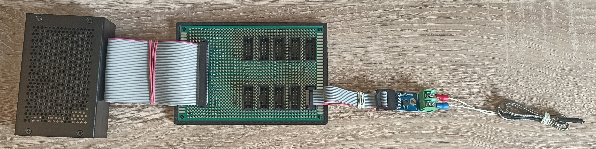

# MAX6675 Station

## Prepare SD card
For the raspbian installation use the RPi imager tool
https://github.com/raspberrypi/rpi-imager
```
sudo apt install rpi-imager
```
* choose RPi OS Lite 64-bit
* go to advanced options
  * setup wifi credentials
  * enable ssh
  * change hostname to `max6675`
  * change username and password
* start flashing and wait till done

## Connect to the RPi and prepare it to work

Power on raspberry with flashed SD card and connect it to the network.
Preferably via cable, otherwies it can be difficult to find it as the hostname is not shown over wifi. 
```
nmap -p 22 --open -oG - xx.xx.xx.0/24 |grep max6675
```

When the IP address is known, connect through SSH.
```
ssh pi@xx.xx.xx.xx
```

Install basic tools
```
sudo apt install git
```

Install rust toolchain
```
curl --proto '=https' --tlsv1.2 -sSf https://sh.rustup.rs | sh
```

You can also install `Remote - SSH` extension to the VScode on your host machine and connect through remote development.

## Connect sensors to the RPi

The board is designed for Raspberry PI 4 with 40 pin GPIO connector. The older 26 pin connector used for RPi 1 will not work.
There is used BCM GPIO numbering. It is NOT the physical position of the pin on the connector!!!.

Sensor pinout is following.
```
MAX6675 -> Raspberry Pi
GND
VCC
SCK     -> GPIO 11 / SPI 0 SCLK
CS
MISO    -> GPIO 9 / SPI 0 MISO
```
CS pins pinout for each sensor. ID is sensor ID in software.
```
| |
| |   ID    0 |  1 |  2 |  3 |  4
|R|   GPIO 14 | 15 | 18 | 27 | 23
|P|   ===========================
|i|   ID    5 |  6 |  7 |  8 |  9
| |   GPIO 20 |  1 |  7 | 25 | 24
| |
```



## Run the application

```
git clone https://github.com/jankrejci/max6625-station.git
cd max6625-station
cargo run --release
```

Results appears on `ip_address:8080/metrics`.
Sensors are able to do hotplug so you can add or remove sensors as you wish.

Sample output of the webpage
```
sensor_id:   0, temperature  27.75
sensor_id:   4, temperature  27.00
sensor_id:   9, temperature  26.50
```

## Board is protected with casing

To avoid short circuit with debris on the table or to bend wire bridges on the bottom of the board, use the plastic board cover.
[Onshape source](https://cad.onshape.com/documents/c77e73b9701d2fd368085f47/w/37a552272d54a35bf61630fc/e/6485fd3e625ea64f218d507f?renderMode=0&uiState=649563e23055f3052693dbb6),
[STL model](./resources/max6675-case.stl) 